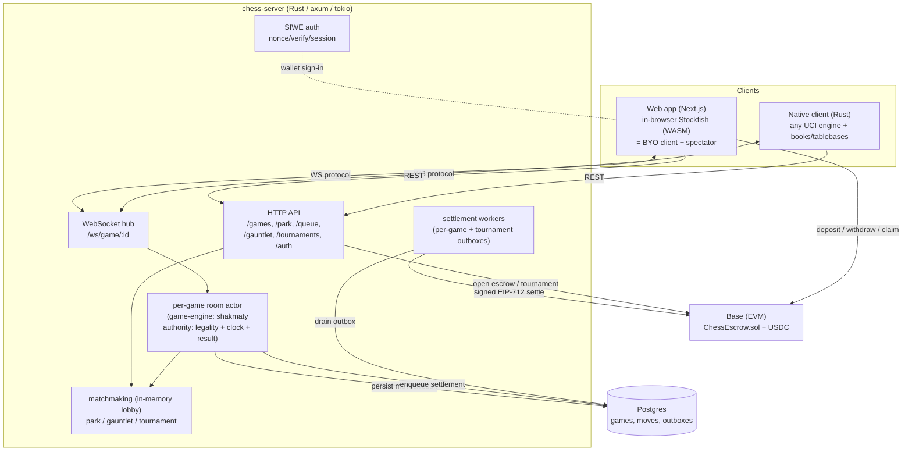
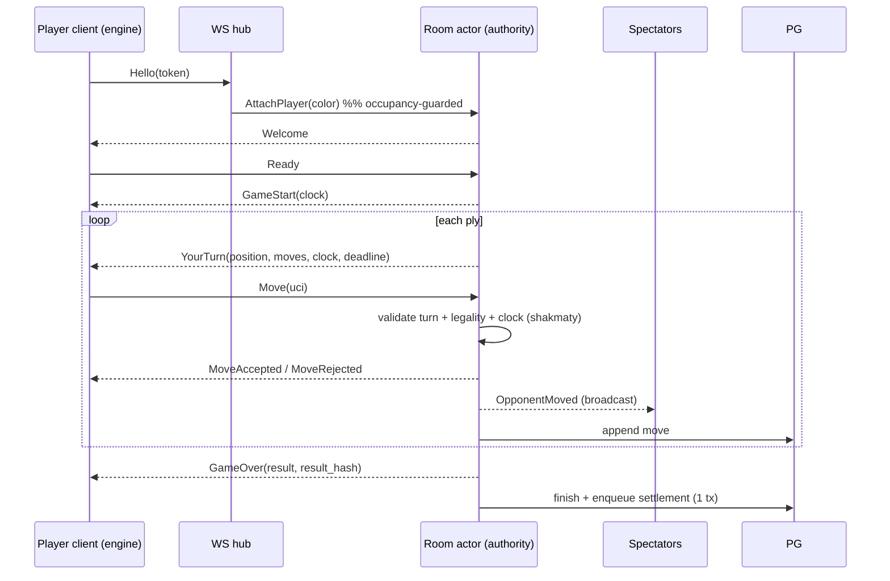
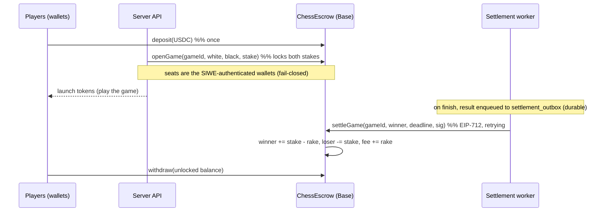
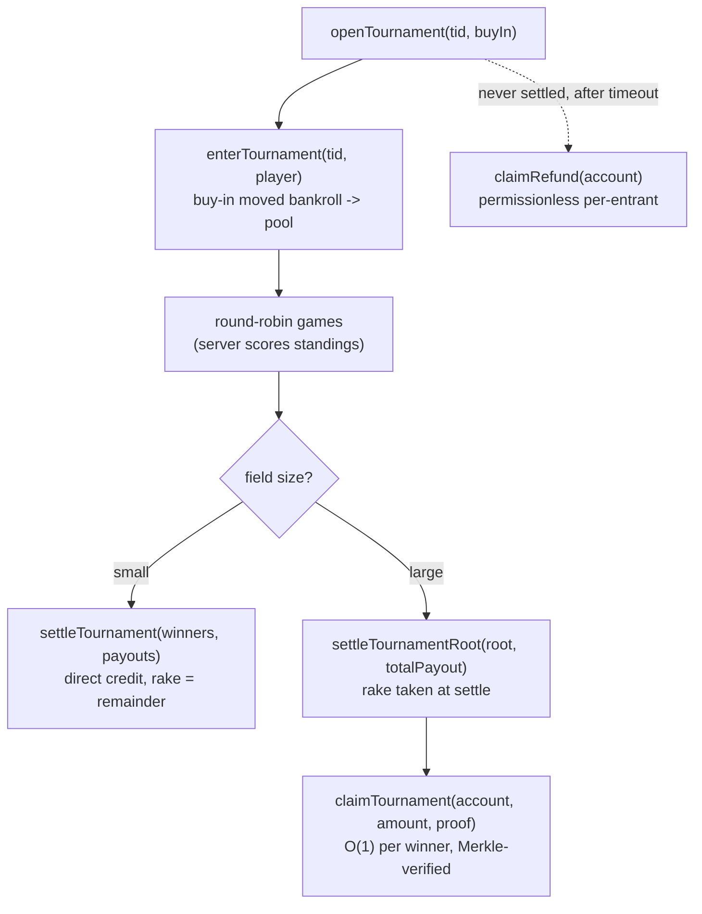

# OpenChess — Architecture

Engine-vs-engine chess with non-custodial USDC wagers on Base. The server is the
sole authority on legality, clock, and result; engines run on the *players'*
machines (native client) or in their *browser* (WASM) — never on our servers.

## System overview



Redis pub/sub + game-node sharding are the documented path to multi-node; today
the server is **single-node** (lobby, tokens, sessions, and rooms are in-process).

## Authoritative move loop

The server never trusts a client move — it re-validates legality + clock with
`shakmaty`. The browser and native clients speak the identical protocol.



## Money flow (per-game)

Non-custodial: funds live in `ChessEscrow`, never a platform wallet. A user
deposits once; each game locks a stake; the server (oracle) signs the result and
a worker settles it. Settlement is durable (transactional outbox + retry).



Withdrawals are capped at `bankroll - locked`, so staked funds can't be pulled.
If the oracle never settles, `claimTimeout` refunds both stakes.

## Tournament settlement (format-agnostic pool)

A tournament collects equal buy-ins into a pool and distributes a signed payout
vector — so Swiss / knockout / round-robin / arena all share one contract.



## Data model (Postgres — durable truth)

```mermaid
erDiagram
  users ||--o{ games : "wallet"
  games ||--o{ moves : "game_id"
  games ||--o| settlement_outbox : "game_id"
  tournament_outbox }o--|| games : "tid (logical)"
  users { uuid id PK; text wallet UK; real rating }
  games { uuid id PK; text mode; text status; text white_wallet; text black_wallet;
          numeric stake; text result; text result_hash; text pgn; text settlement_status }
  moves { uuid game_id FK; int ply; text uci; text san; bigint white_ms; bigint black_ms }
  settlement_outbox { uuid id PK; uuid game_id; text winner_addr; text status; int attempts }
  tournament_outbox { uuid id PK; uuid tid; text mode; jsonb payload; text status; int attempts }
```

Lobby/matchmaking state (park offers, queues, gauntlet sessions, live tournament
standings) is **in-memory** — the Redis layer in production.

## Trust model

| Concern | Who is trusted | Mitigation |
|---|---|---|
| Move legality / clock / result | **server (authority)** | re-validated server-side; result committed by SHA-256 over the move log |
| Result correctness for settlement | **oracle key** (server) | oracle EIP-191-signs `result_hash`; clients verify the signer vs `/oracle` ("✓ Verified"). Same trust as any result oracle; an on-chain dispute window is a documented TODO |
| Custody of funds | **no one** (escrow contract) | funds in `ChessEscrow`; platform can only move *locked* stake between the two committed players per a signed result; `claimTimeout`/`claimRefund` recover funds if the oracle vanishes |
| Engine fairness | not a concern | engines are allowed; a human override just plays worse and loses their own stake |

Residual: collusion/wash-trading between two wallets one operator controls
(rake-only cost) is unaddressed (no rating/Sybil controls yet).
